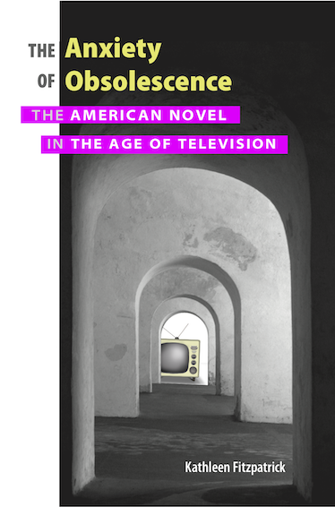
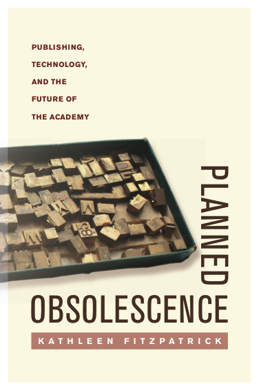
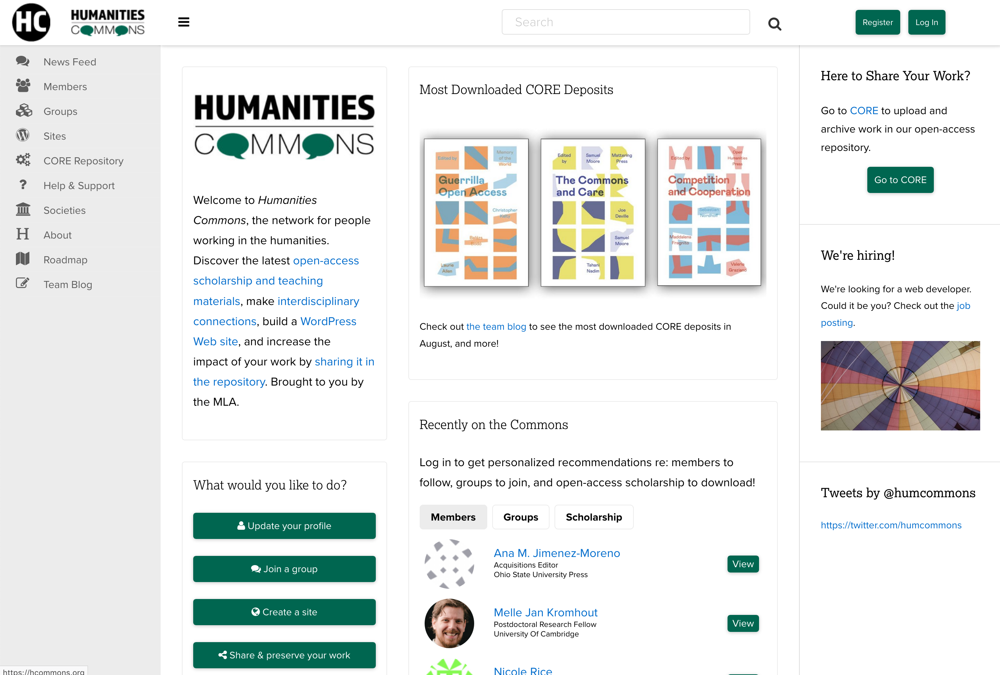
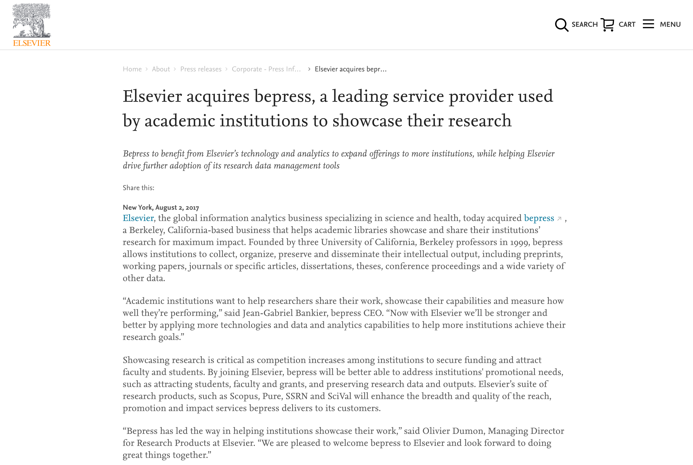
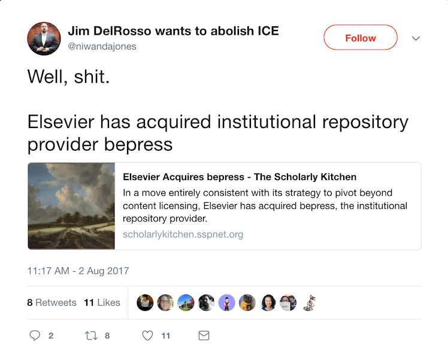
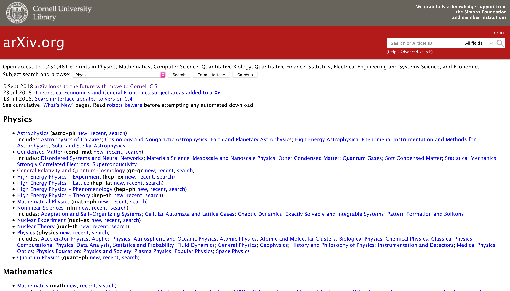
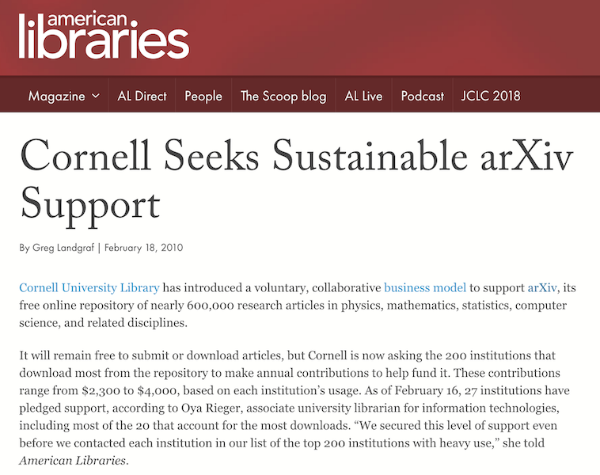
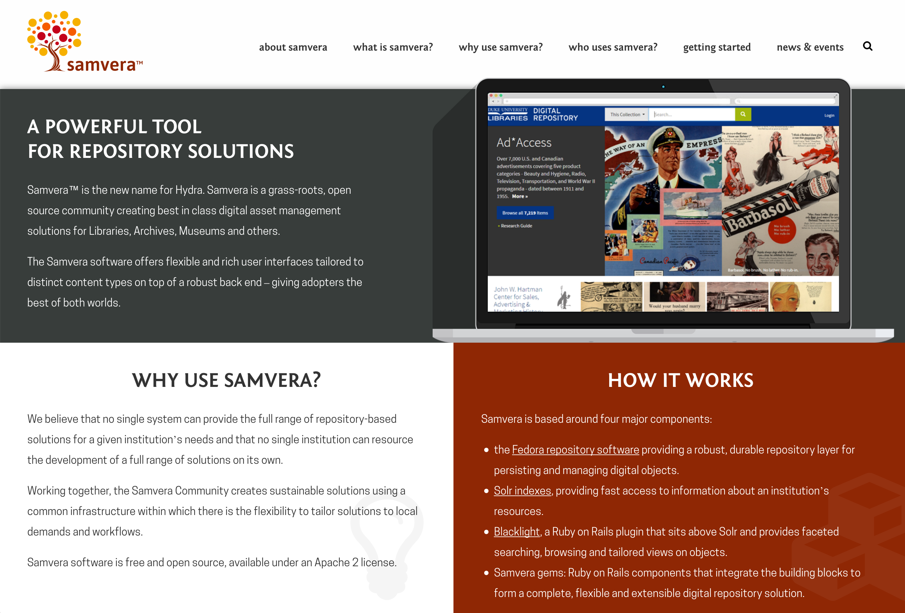
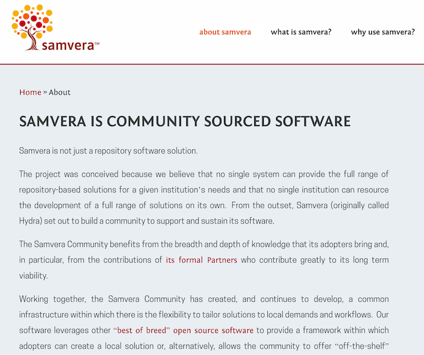
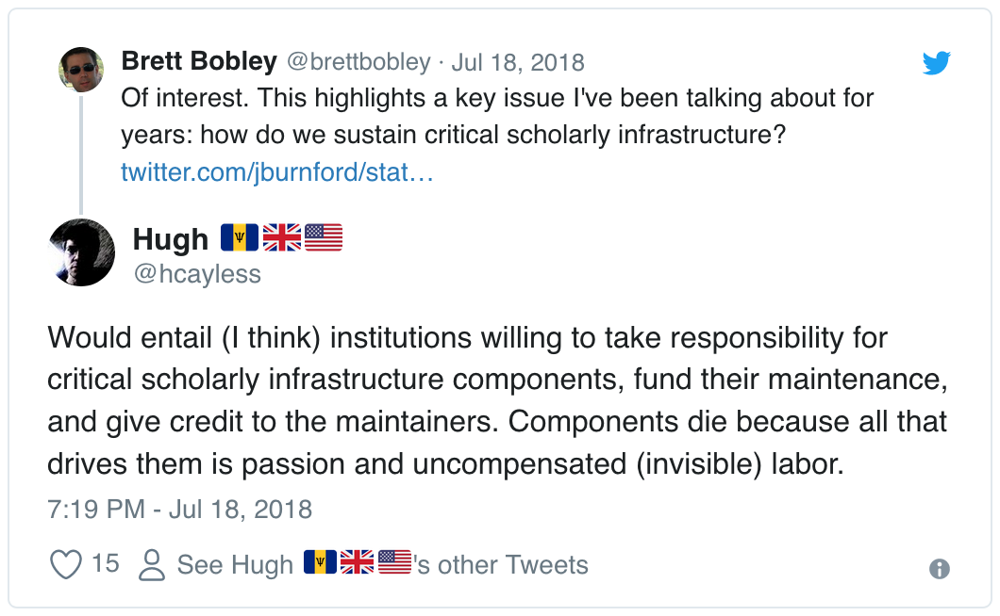

# Sustainability and Solidarity
---
### Toward a Common Good
---
##### Kathleen Fitzpatrick // @kfitz // kfitz@msu.edu

Note: I want to start today by thanking the conference organizing team for inviting me to join you here today. I'm really looking forward to the conversations that develop over the course of things. I've done a fair bit of thinking and writing about obsolescence over the years, and while I've gradually moved away from that work -- in fact, I'm about to publish my first book that does NOT have "obsolescence" in the title -- I'm glad to have the opportunity to revisit some of that thinking from a slightly different angle, which has surfaced some connections for me that I wasn't fully aware of.

Note: In my first book, the obsolescence that I explored was something of an ideological construct. The declaration of the novel's obsolescence in the age of television, that is to say, was thus neither a material fact nor even a cultural likelihood, but rather a position assumed by a subset of late-twentieth century American novelists as a means of shoring up their priority in an era of proliferating and competing media forms.

Note: In my second book, which turned from thinking about the state of contemporary American fiction to thinking about the state of contemporary scholarly communication, the notion of obsolescence with which I dealt was a bit more ambiguous. New internet-based communication practices were highlighting the somewhat dated ways in which scholars conventionally disseminate their work, and those practices bore some careful examination if they were to keep up with and even take advantage of the networks through which that work was increasingly beginning to move and create interaction.

Note: In both cases, the seemingly obsolete object -- the novel, or the scholarly monograph -- continues along just fine, because there's no real threat to the former and because the latter still serves some key purposes for its audience, even if that audience is shrinking. The novel renews itself even as it stays the same, and the scholarly monograph is being reinvented by a number of presses that are experimenting with new, open, interactive platforms that allow it to do its work in net-native ways.

Note: Though the new book, which will be out early next year, doesn't mention obsolescence at all, it actually deals with what is coming to seem a far more threatened object: the university as we once knew it, and especially the American public university that served in the middle of the twentieth century as a highly accessible engine of social mobility, making a rich liberal-arts based education broadly available. We are facing today not just the drastic reduction in that institution's affordability but an increasing threat to its very public orientation, as rampant privatization not only shifts the burden of paying for higher education from the state to individual students and families, but also turns the work of the institution from the creation of a shared social good -- a broadly educated public -- to the production of market-oriented individual benefit.

Note: And all the while, we are also facing what Inside Higher Ed reported just this week as "a larger than typical decline in confidence in an American institution in a relatively short time period." And this falling confidence cannot be simply dismissed as evidence of an increasingly entrenched anti-intellectualism in American life -- though of course, without doubt, that too -- but rather must be understood as evidence that, as I argue in the last chapter of _Generous Thinking_, higher education has for the last several decades been operating simultaneously under two conflicting paradigms -- on the one hand, an older paradigm, largely operative within the academic community, in which the university serves as a producer and disseminator of knowledge; and on the other hand, a more recent one, in which the university serves as a producer and disseminator of market-oriented credentials. The crisis in higher education today stems both from the incommensurability of these two paradigms and from the fact that _both of them are failing_, if in different ways.

## Thomas Kuhn

Note: As Thomas Kuhn noted in _The Structure of Scientific Revolutions_, the failure of a scientific paradigm, as it becomes beset by anomalies for which the paradigm cannot account, throws the community that relies on that paradigm into crisis. And the resolution of that crisis requires the discovery of a new model entirely, one that can reorder the work done by the community and draw it out of what he describes as the "period of pronounced professional insecurity" that appears when normal science ceases to function normally. This crisis can only be resolved in Kuhn's model by what he famously called a paradigm shift, the cataclysmic transformation from one way of understanding how science operates to another. And my argument is that we are desperately in need of such a paradigm shift if higher education as we want it to be is to survive.

Note: The book explores this problem from a number of different angles, asking all of us who care about the future of higher education -- faculty, staff, administrators, students, parents, policymakers, trustees, and more -- to reorient our thinking about the work of the university from the creation of individual benefit, grounded in all of the competition that structures every aspect of life in contemporary institutions of higher education, to instead focus on the university's role in building community.

Note: So some of my thoughts here today grow out of this aspect of _Generous Thinking_, but some stem more pragmatically from my work over the last several years on _Humanities Commons_, which is a non-profit, community-developed and governed network serving humanities scholars and organizations.

## public

Note: Humanities Commons attempts to instantiate several of the arguments of _Generous Thinking_: first, that higher education, along with the individual scholars and instructors engaged in it, will benefit from all of us doing more of our work in public, where the publics that we need to support our institutions can begin to see the significance of what we do; and second, that institutions of higher education must do everything they can to resist and reverse the privatization that has not just overtaken them, but that threatens them with a very real and all too material obsolescence, restoring service to the public good not just to their mission statements but to the heart of their actual missions. Only this return to a fully public orientation can allow universities to build the kind of community that can sustain them.

## community-supported infrastructure

Note: And part of resisting privatization, for both scholars and their institutions, involves turning away from some of the commercial systems on which we have been led to rely. For scholars, this involves finding open, nonprofit, academy-led alternatives to the venture-capital funded services like academia dot edu and research gate, as well as refusing to donate our labor to corporate entities that profit at the academy's expense. For our institutions, this move requires not just finding those alternative systems for knowledge production and dissemination but in fact supporting them, focusing on the collaborative development of the shared, publicly oriented systems that might better serve the academy's needs. Such systems -- community supported and academy owned -- might set the stage for new modes of open knowledge sharing, and might help higher education return to its mission of public service. But developing this form of community-supported infrastructure will require some careful thinking about the relationships required to build and maintain it, and the work that will be necessary to make it sustainable, and that's the project I have ahead.

Note: Though the issues that I'm discussing long predate this particular moment, they came into stark visibility in August 2017, when bepress, a company that provided a rich suite of publishing and repository tools used widely by college and university libraries, announced that it had been purchased by the RELX Group, the multi-national parent company of publishing behemoth Elsevier.

Note: Why was this a big deal? Bepress, originally known as the Berkeley Electronic Press, was established in 1999 by two members of the faculty of UC Berkeley's law school in order to provide open-access publishing and repository services to institutions of higher education. Bepress thus grew out of the academy, and was widely seen as operating with the academy's values at its heart.

Note: As the bepress website notes, over 500 institutions have purchased bepress services in order to disseminate and preserve the work being done on their campuses in openly-accessible ways. And in one fell swoop, these 500 institutions discovered that they were now effectively paying Elsevier for the ability to provide an open alternative to the increasingly monopolistic scholarly communication channels owned by corporate publishing behemoths such as Elsevier.

Note: The reaction among libraries was swift and clear: this was not what they'd signed on for. What had served for years as a key piece of scholarly infrastructure -- built and run by academics, for the academic community -- had been turned on them. That isn't to say that librarians had been unaware that bepress was a commercial service all along, but they'd calculated its costs against the often impossible task of maintaining their own repository and publishing systems, and decided that it was worth it. Bepress provided what many saw as best-of-breed functionality at a reasonable price, and it supported libraries' desire to connect the gathering and preservation of research materials with the ability to make them openly available to the world.

Note: But the acquisition of bepress by Elsevier not only put libraries in the position of supporting a growing corporate monopoly not just on scholarly publishing but on the entirety of the research workflow, from discovery through production to communication; it also left those libraries anxious about their fundamental ability to control the infrastructures on which they rely for collecting and disseminating the work they're doing to promote greater public access to scholarship produced on their campuses. As a result, several libraries, led by Penn, began investigating a move to "beprexit," hoping to leave the platform behind in favor of open-source, academy-owned and controlled infrastructure.

Note: This is not an impossible move, by any stretch, but it's harder than it might at first appear. There are several long-standing open access, open infrastructure projects that we might learn from, including arxiv.org, the pre-print server serving physics, math, and several related fields. ArXiv was founded in 1991 by Paul Ginsparg at the Los Alamos National Laboratory; when Ginsparg took an appointment at Cornell in 2001, arXiv moved with him, where it was hosted and supported by the Cornell University Library.

Note: Over the years, use of arXiv vastly accelerated, resulting in significant pressure on the system's storage, bandwidth, and other aspects of its infrastructure. And while the library was committed to sustaining what had come to be a crucial, paradigm-shifting project in scholarly communication, it was becoming increasingly difficult to do so on their own.

Note: In 2011, facing not just growing annual operating costs -- which were about 500,000 dollars then, and are approaching 1.2 million dollars today -- but also a mounting technical debt (as that budget was entirely devoted to day-to-day maintenance and management, and not upgrades or future development), the arXiv team at Cornell began the challenging process of building a coalition of libraries willing to work together to support the resource.

Note: This model has largely been successful but has required active investment in the kinds of community-building to which our institutions are largely unaccustomed, another form of labor on top of maintaining the system itself. ArXiv has recently announced that it will in January be moving from the Library to Cornell Computing and Information Science, which will take a strong role in guiding the project's technical development, but the challenges of maintaining a coalition will remain.

Note: We might find another example, with a quite different narrative, in the Samvera project. Samvera is an open-source repository platform being developed collaboratively by the library community, focusing precisely on the need for alternatives to commercial products like bepress. Recognizing that no single institution could possibly develop the full suite of systems on which institutional repositories rely, developers at a number of institutions have come together to create a collective solution. As the proverb and their website have it, if you want to go far, go together.

Note: That is not to say that this distributed developer community hasn't faced significant challenges in coordination, challenges that have caused it, as the proverb also reminds us, to go more slowly than it might. Ensuring the ongoing commitment not just of the individual developers but of the institutions for which the developers actually work to this shared project is not a simple matter.

# sustainability

Note: The foundation of the challenges that both arXiv and Samvera have faced is similar, though it has manifested differently. And it's the fundamental challenge faced by any number of projects and programs and initiatives: sustainability. This is an issue I've been thinking a fair bit about of late, as my colleagues and I have been working to ensure that Humanities Commons might be able to thrive well into the future. And those attempts have in turn been encouraged by the funders and other organizations that have supported the network's development to this point; they too would like to see the network thrive, but they cannot support it indefinitely. We need, they reasonably suggest, a plan for demonstrating that the network will, at some point in the future, be able to support itself.

Note: Sustainability of this sort is tied up in revenue models, in business plans, in cost recovery. Sustainability is for a non-profit entity forever tied to the economic and, as a result, forever precarious. One small miscalculation can make the difference between survival and collapse.

Note: But sustainability extends to domains beyond the economic. There is of course environmental sustainability, in which we attempt to ensure that more resources aren't consumed -- or more waste produced -- than can be developed or managed in the near term. 

Note: There's technological sustainability, in which we attempt to ensure that projects conform to commonly accepted standards that will enable those projects' future stability and growth.

Note: All of these forms of sustainability are important, to varying degrees, to providing for the future of non-profit and open-source projects. But there's another form that gets a good bit less attention, and that I increasingly think precedes economic or environmental or technical sustainability: social sustainability. The social aspect points not just to the determination of a group of people to support a particular project, but to the determination of those people to support their groupness; not just to their commitment to the thing they're doing together, but to their commitment to the concept of "together" in the first place. Ensuring that these commitments are sustained is, I increasingly think, a necessary precondition for the other kinds of sustainability that we're hoping to work toward.

# community

Note: This notion -- of the role of "community" in community-supported software, and of the best ways of building and sustaining it -- raises the key question of what it is we mean when we talk about community. As Miranda Joseph argues in _Against the Romance of Community_, the concept is often invoked as a placeholder for something that exists outside the dominant economic and institutional structures of contemporary life, a set of ostensibly organic felt relationships that harken back to a mythical premodern moment in which people lived and worked in direct connection with one another, without the mediating forces of modern capitalism.

# "community"

Note: "Community" is in this sense, in Benedict Anderson's sense, an imagined relationship, and even an imaginary one, as its invocation is designed to yoke together bodies whose existence as a group is largely constructed. It's a concept often used both idealistically and as a form of discipline, a claim of unity that smooths over and thus suppresses internal difference and disagreement. And, as Joseph points out, the notion of community is often deployed as if the relationships that it describes could provide an antidote to or an escape from the problems created by contemporary political and economic life. But this suggestion serves to distract us from the supplementary role that community in fact actually serves with respect to capitalism, filling its gaps and smoothing over its flaws in ways that permit it to function without real opposition. So we call upon the community to support projects that the dominant institutions of the mainstream economy will not. And this is how we end up with social network–based fundraising campaigns to support people facing major health crises, rather than demanding universal health care, and elementary school bake sales rather than full funding for education. "Community" becomes, in this sense, an alibi for the creeping privatization of what should be social responsibilities.

Note: So it's important to be careful in issuing calls to build community: such calls, issued uncritically, not only run the risk of enabling the institutions that structure contemporary life to absolve themselves of responsibility for public care, but they also risk essentializing a highly complex and intersectional set of social relations, treating those relations as if they were a simple, single thing. At the same time, though, there are some important uses for the notion of community that remain, uses that might benefit from an analogy to Gayatri Spivak's "strategic essentialism." In these uses we might simultaneously recognize that our calls to community are flawed, in fact impossible, but nonetheless useful as organizing tools. 

# solidarity

Note: We might thus begin to think of the call to community not as an invocation of organic unity but instead as a form of coalition-building, of a developing solidarity. Solidarity itself is a challenged concept, of course; there are important questions to be asked about solidarity with whom, and for whom. 

Note: Women of color, for instance, have pointed out the extent to which white feminist appeals to solidarity reinforce white supremacy, demanding that black women put the issue of race aside in favor of a gender-based unity that overwhelmingly serves white women's interests, leading author Mikki Kendall to establish the Twitter hashtag #SolidarityIsForWhiteWomen. So I don't want to make it sound as though "solidarity" can serve as an unproblematic substitute for "community."

Note: But I remain convinced that there are stronger forms of solidarity to be found, forms that do not demand that others drop their own issues and get in line, but that instead recognize that the issues of those others are all of our issues too, and that we must stand together in support of needs that may not necessarily seem to be our own. And this is the form of solidarity that I'm seeking, a form that I am convinced is a necessary prerequisite for successful, sustainable development of non-profit, open-source, community-owned networks and platforms.

Note: What's the connection? For me, sustainability and solidarity connect through the work of Elinor Ostrom. Ostrom was not just, as the UBS Nobel Perspectives website has it, the first female Nobel laureate in economics; she remains to date the _only_ female laureate in the field. Her work focused on common-pool resource management; she argued fiercely against the conventional wisdom that the so-called tragedy of the commons was an inevitability, insisting that community-based systems and structures for ensuring those resources' sustainability were possible, provided the right modes of self-organization and self-governance were in place.

## common-pool resources

Note: It's important first to understand a bit about what is meant by the notion of common-pool resources. Resources are generally understood by economists to fall into one of four categories, based on whether they are excludable -- whether individuals can be prevented from using them -- and whether they are rivalrous -- whether one individual's use precludes another's. Public goods are those resources that are both nonexcludable and nonrivalrous, meaning that no one can be prevented from using them and that no one's use reduces its availability for use by others. By contrast, private goods are both excludable and rivalrous; they can be restricted for use by paying customers, and their consumption by one customer can diminish its availability to another. These private goods are market-based products, typically produced and distributed for profit. Club goods are those that are excludable but nonrivalrous, those that are restricted to paying customers but not diminished by any one customer's use. And finally, goods that are nonexcludable but rivalrous are often described as common-pool resources: it is these goods to which the "tragedy of the commons" -- the overuse of shared natural resources -- can apply.

## the "free rider" problem

Note: At the root of the tragedy of the commons lies the "free-rider problem," which derives from the assumption that when individuals cannot be prevented from using commonly-held resources, but also cannot be compelled to contribute to them, some number of individuals will avail themselves of the resources without contributing to their support. As the number of free riders grows, the resources become prone to overuse and eventually become unsustainable. The only means imagined to help prevent the tragedy of the commons, before Ostrom, was external regulation, whether through privatization or nationalization.

## _Governing the Commons_

Note: But as Ostrom argued in her 1990 book _Governing the Commons: The Evolution of Institutions for Collective Action_, this model -- like other such models as the prisoner's dilemma -- was based on a particular, and particularly pessimistic, view of human possibility, one that could not escape from its own metaphor.

> What makes these models so dangerous -- when they are used metaphorically as the foundation for policy -- is that the constraints that are assumed to be fixed for the purpose of analysis are taken on faith as being fixed in empirical settings, unless external authorities change them.... I would rather address the question of how to enhance the capabilities of those involved to change the constraining rules of the game to lead to outcomes other than remorseless tragedies. (Ostrom 6-7)

Note: READ SLIDE; Ostrom's work thus explored ways of organizing collective action that might ensure the sustainability of commonly-held resources. And while Ostrom focused on natural resources, such as fisheries, the problems she described, and the potential solutions she explored, have some important things in common with institutions of higher education and the non-profit, community-developed, academy-owned software projects -- like arXiv, like Samvera, like Humanities Commons -- on which they should be able to rely.

Note: There are lots of potential examples of free and open digital scholarly platforms and projects like these, all of which face a common problem: there is often sufficient support available for building and implementing such systems, but there aren't funding programs designed to ensure that they can be maintained. And as a result, as with arXiv, the tools and platforms accrue technical debt that becomes increasingly difficult to manage, rapidly making the projects appear unsustainable and thus leaving them in real danger of obsolescence.

Note: Some argue that the best means of ensuring the sustainability of such projects is economic: eliminating the free-rider problem by enclosing the commons, requiring individuals or institutions to pay in order to access them. But this privatization is, in many cases, the problem that community-developed projects were developed to evade. So as with Ostrom's fishing communities, it's incumbent on us to find the right modes of self-organization and self-governance that can keep the projects open and thriving.

Note: Brett Bobley recently tweeted a question about ways of sustaining such projects. Numerous discussions and threads resulted from that question that are worth reading, but one that caught my attention in particular stems from this reply by Hugh Cayless -- 

Note: -- noting the institutional responsibility for maintaining such projects, about which I absolutely agree, especially when he moves beyond the economic into issues of labor and credit. However, as I argue in _Generous Thinking_, individual institutions cannot manage such responsibilities on their own. Cross-institutional collaborations are required in order to keep open-source software projects sustainable, and those collaborations demand that the staff participating in them not only be credited and paid appropriately for their labor but -- most challengingly -- that they be supported in dedicating some portion of their labor to the collective good, rather than strictly to local requirements.

Note: Which is to say that individual institutions of higher education must understand themselves as part of a community of such institutions, and they need accordingly to act in solidarity with that community. And this is why I increasingly want to argue that sustainability in open-source development has solidarity as a prerequisite, a recognition that the interests of the group require commitment from its members to that group, at times over and above their own individual interests. What I'm interested in thinking about is how we foster that commitment: how, in fact, we understand that commitment itself as a crucial form of social sustainability.

## collaboration

Note: But getting institutions to stop competing with one another and start recognizing that they have more to gain from collaboration than they stand to lose in the rankings is no easy task. The privatization that has gradually overtaken them since the Reagan era has resulted in a fundamentally market-oriented, competition-based approach to everything the institution does. Making the argument that this approach must be set aside,  is a huge part of what I've tried to do in _Generous Thinking_, and it's a huge part of what we're trying to instantiate in Humanities Commons.

Note: A bit of background, for those of you who may not be fully familiar with the project. The MLA is the largest scholarly society in the humanities, representing around 25,000 members across North America and around the world, members who teach and study a very wide range of languages, literatures, and cultures. (The MLA is also my former employer.) With support from the Andrew W. Mellon Foundation, we launched a social network called MLA Commons in 2013 to provide members with a platform for communication and collaboration, both in order to extend year-round the kinds of conversations that take place at our annual meetings and to provide means for members to share their scholarly work with one another. Within about 30 seconds of launching the platform, however, we began to hear from our members about their desire to connect with colleagues in other areas in the humanities, so we started looking for ways to support those connections across fields. 

Note: With further support from the Mellon Foundation, we first undertook a planning process and developed a pilot project designed to connect multiple proprietary Commons instances, each serving the membership of a scholarly society. Humanities Commons went live in December 2016, linking MLA Commons with Commons spaces developed for the members of the Association for Jewish Studies, the Association for Slavic, East European, and Eurasian Studies, and the College Art Association. But beyond working with these partners, we wanted to provide a space where any researcher or practitioner in the humanities could create an account and share their work, and so we made the decision to open the network's hub to anyone who wants to join -- across the disciplines, around the world, regardless of institutional affiliation or organizational membership.

Note: All Humanities Commons members can take advantage of all of the network's features. They can create rich professional profiles, participate in group discussions, create websites, and they can deposit and share their work in the network's open-access repository. This fusion of a social network with a library-quality repository (adhering to commonly accepted metadata standards, employing digital object identifiers, and so on) means that not only is stuff being put into the repository, and not only can that stuff be found there, but it's also being actively used, as there's a community there with which it can be shared.

Note: But while fully opening the Humanities Commons hub to free participation by any interested scholar or practitioner has significantly driven the platform's adoption and use -- not quite two years later, we have over 15,000 members -- it has created real challenges for our sustainability. Partner organizations have tended to see the value in paying to support the network's services as lying in a benefit that they can provide to their members. It's understandable, as they need to provide such benefits in order to keep their members paying dues. But this model transforms Humanities Commons from a common-pool resource into a club good, one whose benefits are exclusive to those who pay. And some early interviews seem to suggest that many of the organizations who might have paid for the network if it were an exclusive service see the openness of the hub as diminishing the network's value to them, rather than recognizing that the network effects of a larger, more open community will ultimately serve their long-term interests.

Note: So we've been at work on a sustainability plan for the network over the last year, hoping to develop a model that will encourage organizations and institutions to invest in the network, to support it in an ongoing way, to recognize that not only do they belong to the network, but that the network belongs to them, and its future depends on them. Making that case requires not just a workable revenue model but, far more importantly, a compelling governance model, one that gives member organizations and institutions, as well as individual members, both a voice in the network's future and a stake in its outcomes. As Ostom argues, a path to sustainability for a common-pool resource like Humanities Commons requires us to ensure that building the network's community and enabling it to become self-governing is a precondition for its success.

## sustainability and solidarity

Note: So the future of Humanities Commons, like the future of a host of open-source software and community-supported infrastructure projects, requires its participants to act in the interest of the collective, even where those interests do not immediately appear to be local. This form of solidarity is where real sustainability for academy-owned infrastructure -- and for the academy itself -- lies. My arguments to this end, probably needless to say, have a tough road ahead of them, but I remain hopeful, and determined, that those of us working on projects like Humanities Commons --

# together

Note: -- can together -- ah! together! -- find ways to go far.

## thank you
---
##### Kathleen Fitzpatrick // @kfitz // kfitz@msu.edu
